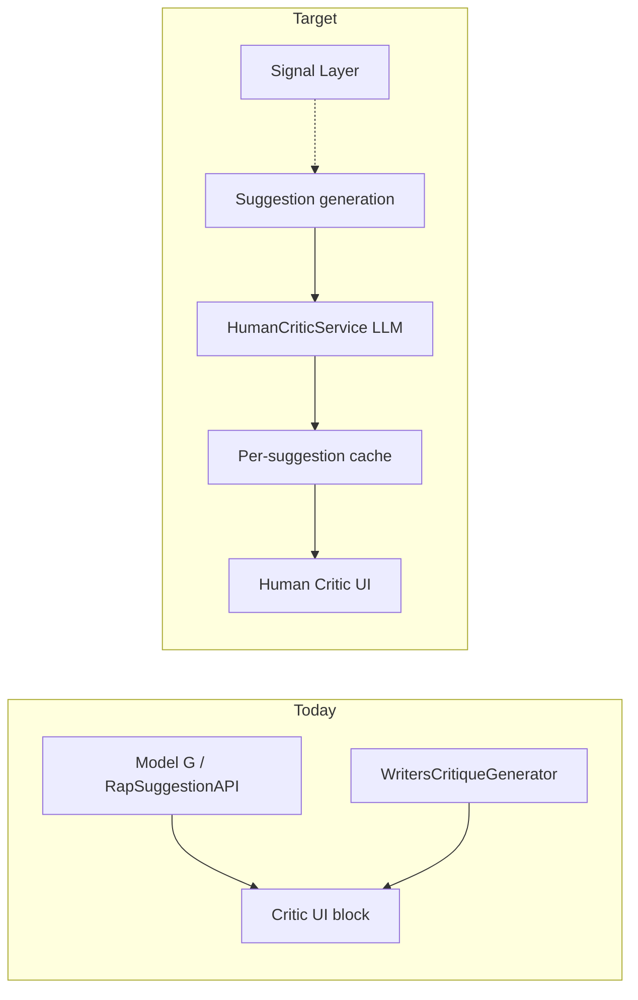

# Human Critic Redesign — Rap Suggestions Feedback

**Date:** 2026-06-01  
**Status:** Phase 1 implemented (calm editor; voice toggle deferred to Model Preferences)  
**Goal:** Replace low-value, jargon-heavy “Critic” copy with feedback that reads like a thoughtful human listener—specific, emotional, and actionable.

---

## Problem (today)

The orange **Critic** section under each suggestion in `RapSuggestionView` is driven by `WritersCritiqueGenerator.compareLines()` (`WritersCritique.swift`). It is **not** LLM-generated.

| What users see | Why it happens |
|----------------|----------------|
| “These lines continue your narrative while maintaining your register position.” | Default fallback in `buildWhySuggested()` when `suggestion.reasoning` is empty and Signal mode is `.defaultExpressive` |
| “Using full verse (9 lines) for analysis…” | `buildContextInfo()` — internal plumbing exposed as UI |
| “Your last line” / “Generated” repeated | `buildComparisonCommentary()` duplicates labels already shown in the card |
| Posture / authority / lexicon jargon | Rule templates keyed off `SignalMode`, not the actual lyrics |

**Separate systems (confusing overlap):**

1. **Critic block** — rule-based line comparison (screenshot).
2. **`arCritique`** on `RapSuggestion` — LLM A&R executive tone, only when `narrative.generatorPolicy.artistBias == .gunna` (`generateARCritiques` in `RapSuggestionAPI.swift`).
3. **`ARCritiqueGenerator`** — rule-based line flags for `ARCritiqueSheet`.
4. **`CriticCommentary`** — template copy when generation returns “silence.”

Users experience one brand (“Critic”) but get engineer-facing Signal Layer language. That fails the product promise of a co-writer who *reacts* to the verse.

---

## Success criteria

After this work, a user opening **Rap Suggestions** should be able to answer:

- **What landed?** — e.g. “The ‘Suicide Doors’ image hits—it’s concrete and memorable.”
- **What fell flat?** — e.g. “‘Toxic code’ feels vague next to your stronger money lines.”
- **How did it make me feel?** — laugh, hype, cold, sad, bored (plain language).
- **What should I do next?** — tie to hook, tighten a bar, cut a repeat, push the metaphor.

**Anti-patterns (must not ship):**

- “Register position,” “signal profile,” “alignment threshold,” “posture difference” in user-visible Critic copy.
- Generic filler when the model has full verse + generated text.
- Two competing critique blocks on the same card (Critic + A&R) saying similar things.

---

## Recommended direction: **LLM “Listener” Critic (primary) + Signal internal only**

Keep Signal Layer for **generation gating and filtering** (unchanged). Move **all user-facing Critic copy** to a dedicated listener pass that reads the verse and suggestions.

### Why not “better templates” alone?

Templates cannot reliably quote lines, detect hook drift, or express genuine reaction without becoming a maintenance maze. You already pay for an API on suggestions; **one small structured critic call per suggestion sheet** is the best cost/quality tradeoff.

### Why not only fix `reasoning` on the main generation call?

Main generation is optimized for *lines*, not feedback. A focused critic prompt reduces format drift and lets you iterate tone without touching Model G core prompts.

---

## Approaches considered

| Approach | Pros | Cons | Verdict |
|----------|------|------|---------|
| **A. Listener LLM pass** (recommended) | Human tone, cites lines, hook/theme aware | Latency + token cost | **Ship** |
| **B. Richer rule templates** | No extra API call | Still generic; brittle | Fallback only |
| **C. Fold into generation JSON** | One round trip | Bloats generation; hard to tune | Defer |

**Hybrid:** A for display; B only when API key missing or critic call fails (short honest fallback: “Connect API key for personalized feedback” or 1-sentence heuristic).

---

## Product model: `HumanCriticFeedback`

Structured output (JSON), decoded in Swift:

```json
{
  "headline": "This batch mostly keeps your cold, money-first tone.",
  "reactions": [
    { "polarity": "positive", "quote": "Suicide Doors, a silent creed", "note": "Strong image—feels cinematic and confident." },
    { "polarity": "negative", "quote": "toxic code", "note": "Abstract next to your concrete flex lines; either define it or cut it." }
  ],
  "feelings": ["hype", "cold"],
  "hook_note": "Your opening sets 'no low vibrational energy'—these lines stay on-theme but could echo that rule in the last bar.",
  "next_step": "Pick one money image and one relationship image per 4 bars so the verse doesn't repeat the same flex."
}
```

**Swift types (new file e.g. `HumanCriticFeedback.swift`):**

- `HumanCriticFeedback` — headline, reactions[], feelings[], hookNote?, nextStep?
- `CriticReaction` — polarity (`positive` | `negative` | `mixed`), quote (substring from verse/suggestion), note
- Optional `loading` / `failed` states on the engine for UI skeletons

**Persona rules (system prompt):**

- Write like a trusted writer in the room—not an A&R exec, not a therapist, not a professor.
- Must quote **short phrases** from user verse or suggestion (max ~8 words per quote).
- No Signal Layer vocabulary in output.
- 2–4 reactions max; 1–2 sentences per note.
- If nothing sincere to praise, say so kindly and focus on one fix.

---

## Architecture



**`HumanCriticService` responsibilities:**

1. Inputs: `userVerse`, `lastUserLine`, `generatedSuggestionText`, optional `themes` / `hookLine` from `NarrativeAnalysis`, optional `directedParams` topics.
2. Call same provider stack as suggestions (OpenAI/Gemini via existing key).
3. Parse JSON; validate quotes appear in source text (soft check—if fail, strip quote marks and show note only).
4. Store on `RapSuggestion` as `humanCritique: HumanCriticFeedback?` **or** side table on `RapSuggestionEngine` keyed by `suggestion.id` to avoid breaking `Codable` persistence.

**When to run:**

- After suggestions are shown (parallel `Task` per top suggestion, or one call comparing user verse vs primary suggestion—see Phase 1 scope).
- Cancel on sheet dismiss.

**Consolidation:**

- **Hide** rule-based `lineComparisonCritique` behind feature flag or remove from default UI.
- **Merge or demote** `arCritique`: either fold best lines into listener output or show A&R only in `ARCritiqueSheet`, not on every card.

---

## UI changes (`RapSuggestionView`)

Replace current Critic block with:

| Section | Example label | Content |
|---------|---------------|---------|
| **Overall** | — | `headline` |
| **What worked** | “What worked” | positive `reactions` |
| **What to fix** | “Could be stronger” | negative / mixed `reactions` |
| **Vibe** | “Felt like” | chips or short list from `feelings` |
| **Hook** | “Hook / theme” | `hook_note` (only if non-empty) |
| **Try this** | “Next step” | `next_step` |

**UX details:**

- Collapse “Using full verse (N lines)…” into a **“How this was read”** disclosure (optional, off by default).
- Remove duplicate “Your last line / Generated” wall of text from commentary.
- Loading: 2–3 line skeleton under Critic header; don’t block inserting suggestions.
- Error: “Personal feedback unavailable—try again” + retry button (no register jargon).

**Silence path (`CriticCommentary`):**

- Rewrite templates in `createSilenceCommentary` to human voice **or** reuse `HumanCriticService` with `generatedLine: ""` to explain why nothing was suggested.

---

## Implementation phases

### Phase 0 — Spec + prompt lab (no UI)

- Finalize JSON schema and 3–5 golden verses (including your screenshot verse).
- Prompt iteration in isolation; reject outputs with banned terms list.
- Document token budget (~300–500 output tokens per call).

### Phase 1 — Listener critic (MVP)

| Task | Files | Detail |
|------|-------|--------|
| 1.1 | `HumanCriticFeedback.swift` | Codable models + banned-term sanitizer |
| 1.2 | `HumanCriticService.swift` | LLM call + parse + retry once on JSON failure |
| 1.3 | `RapSuggestionEngine` | `@Published humanCritiques: [UUID: HumanCriticFeedback]`, fetch after `generateSuggestions` |
| 1.4 | `RapSuggestionView.swift` | New `humanCriticSection`; stop rendering `lineComparisonCritique` by default |
| 1.5 | `WritersCritique.swift` | Deprecate user-facing paths or gate with `#if DEBUG` “Studio diagnostics” |

**MVP scope:** One critic response per suggestions sheet (vs first suggestion only) to limit cost.

**Verify:** Screenshot scenario shows quoted lines + feeling words + hook note; no “register position.”

### Phase 2 — Per-suggestion + line-level polish

- Critic per card if user swipes multiple suggestions.
- Tap quoted phrase → scroll/highlight line in suggestion block.
- Learn from 👍/👎 line feedback (optional prompt hint: “user disliked line 3”).

### Phase 3 — Consolidate A&R + settings

- Remove duplicate `arCritique` on card when `humanCritique` present.
- Profile → AI: toggle **“Studio notes”** (shows old Signal diagnostics) default **off**.
- Analytics: log critic latency, empty reaction rate, user retry.

### Phase 4 — Silence + offline

- Human silence explanations.
- Heuristic fallback when no API key (link to Profile → API Settings using existing `AppNavigation`).

---

## Non-goals (this project)

- Rewriting Signal Layer scoring or alignment thresholds.
- Replacing `ARCritiqueSheet` line-by-line rule engine (unless later merged).
- Multi-language critic (English only first).

---

## Risks & mitigations

| Risk | Mitigation |
|------|------------|
| Extra API cost | One call per sheet; cache by `(verse hash, suggestion hash)` |
| Latency | Async load; suggestions usable immediately |
| Hallucinated quotes | Post-validate quote substrings; drop invalid quotes |
| Preachy / toxic feedback | Prompt: “no moralizing”; blocklist; max length |
| Inconsistent with Model G tone | Pass `ModelSettings` voice summary as 1-line context, not raw field names |

---

## Open question (needs your call)

**Critic voice:** **Defer** — ship **(b) calm editor** now; add friend/hype toggle in Model Preferences later.

---

## Approval checklist

- [x] User-facing Critic = LLM listener, Signal stays internal  
- [x] MVP = one critic call per suggestions sheet  
- [x] Voice: calm editor now, toggle later  
- [x] Hide `arCritique` on card when human critic is present  
